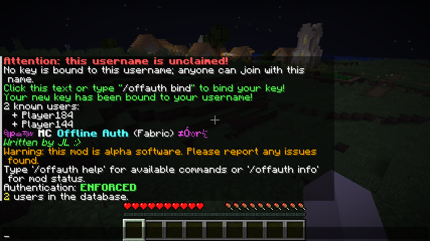

# MCOfflineAuth

---
Basic authentication mod for servers.

**Currently only Fabric is supported; this will hopefully change soon.**

## Installation

**You can use the precompiled binaries which can be found in the [Releases](https://github.com/a455jldvmsrwll1a/MCOfflineAuth/releases) section.**

**Work in Progress**

Building:

1. Clone the repository and enter the project directory.
2. Run `./gradlew build` on Linux/Mac and `.\gradlew.bat build` on Windows.
3. Hopefully it should build just fine.
4. The compiled JAR can be found in `build/libs/MCOfflineAuth-*.jar` (without the `-sources`).

## Usage

**You can do `/offauth help` for available commands.**

In most cases, it is extremely simple:

1. [Install](#installation) the mod.
2. Join a server (with the  mod installed).
3. Click the prompt when you log-on or run `/offauth bind`
4. Done.

The server can be set to reject users without a key already bound. In this case, an admin needs to bind you in advance.

1. Click the **OA** button in the main menu. (Mod screen is also available if you have [ModMenu](https://modrinth.com/mod/modmenu))
2. Click the long button with the key to copy the key.
3. Share this key to an admin of the server.
4. Join the server.

#### Unbinding

To unbind, you can do `/offauth unbind`.

### Operators

Operators can bind and unbind other players, enable and disable the mod, and change some configuration.

To bind another user, run: `/offauth bind <username> <public key>`. Substitute `<username>` with the username and `<public key>` with the key they have provided you.

To unbind another user, run: `/offauth unbind <username>`.

To unbind *all* users, run: `/offauth unbind --`.
