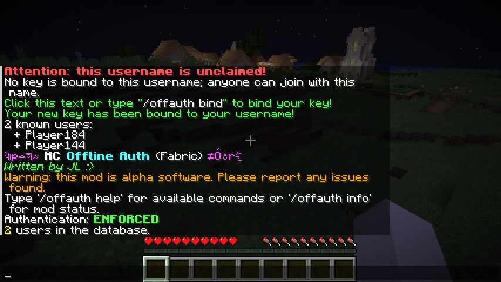

# MCOfflineAuth

---
Basic authentication mod for servers. This mod is not useful on normal servers.

**Only [Fabric](https://fabricmc.net/) is supported here!**

### Click here for the [forge version](https://github.com/a455jldvmsrwll1a/MCOfflineAuth4Forge).

## Dependencies

- [Minecraft 1.21.11](https://www.minecraft.net)
- [Fabric 0.18.4](https://fabricmc.net/) or later.
- [Fabric API 0.140.2+1.21.11](https://modrinth.com/mod/fabric-api/version/0.131.0+1.21.8)
- **[Optional]** [ModMenu 17.0.0-beta.1](https://modrinth.com/mod/modmenu) or later.

## Installation

**Just need to download the mod? You can use the precompiled binaries which can
be found in the [Releases](https://github.com/a455jldvmsrwll1a/MCOfflineAuth/releases)
section.**

Building from source:

1. Clone the repository and enter the project directory.
2. Run `./gradlew build` on Linux/Mac and `.\gradlew.bat build` on Windows.
3. Hopefully it should build just fine.
4. The compiled JAR can be found in `build/libs/MCOfflineAuth-*.jar`, along with the source JAR.

## Quick Start for Players

**You can do `/offauth help` for available commands.**

In most cases, it is extremely simple:

1. [Install](#installation) the mod.
2. Join a server (with the mod installed).
3. Click the prompt when you log on or run `/offauth bind`
4. Wait for admin approval (if required, skipped otherwise).
5. Done.

*Got kicked?* The server may be set to reject users without a key already bound.
In this case, an admin needs to bind you in advance.

1. Click the **OA** button in the main menu.
(Mod screen is also available if you have [ModMenu](https://modrinth.com/mod/modmenu))
2. Click the long button with the key string to copy the key.
3. Share this key to an admin of the server.
4. Join the server.

To unbind your key, you can do `/offauth unbind`.

For more information, read on below.

## Quick Start for Server Operators

Setup should be as easy as dropping the JAR in the `mods` folder.

See the [configuration](#configuration) section below for more info.

## Usage

Explanations about the commands are available below.

`/offauth help` will show the available commands. Commands requiring elevated
privileges will not be shown to users without it.

*For the purposes of this guide, someone with either level 4 operator or the
`mc-offline-auth` permission has **elevated privileges**, and will also be
referred to as an **admin**.*

### Status

To view mod status and list players, run `/offauth info`.

It will display whether it's active or not and how many users are in the
database.

To check a user's key (or lack thereof), run `/offauth info <user>`.
This command can only be run by someone with the `mc-offline-auth` permission
or OP.

### Binding

Players can run `/offauth bind` to bind their key to the server they are in,
after which the server will only accept the valid username and key combination.

If a player needs to change their key, they can run `/offauth unbind` to unbind
their key, and rejoin and bind again. However, this may pose a risk in the
default config, as during the time that the username has no bound key, any
person can bind their own to that name and claim it for themselves.

For players with elevated privileges, they can run `/offauth bind <username> <key>`
to bind any public key to any valid username. This allows admins to, for
example, update the key bound to the username so that the aforementioned risks
of a player having to unbind first can be avoided.

The analogous `/offauth unbind <username>` is also available under elevated
privileges and simply clears the public key associated with the username.

### Grace Periods

By default, players without a key bound to their username can join, and hence
bind their own key to effectively claim that username. However, the server can
also be configured to reject connecting players if their username hasn't been
bound with a key yet.

Grace periods allow an unbound player to join for a certain amount of time.
Note that after the grace period expires, the player cannot join anymore if
they still haven't bound their key, *but they will not be automatically kicked!*

Grace periods are given to anyone who has just unbound their key, in order
to allow them to rejoin and bind the new one.

For new players, admins can give them a grace period to join (since they won't
have a key bound in the first place) via the command `/offauth grace <username>`.

To give a grace period to **ALL** players, run `/offauth grace --` (two dashes).

The duration of the grace period is [configurable](#configuration).

### Request Reviews

By default, players can bind and unbind their own keys at any time.
However, the server can also be [configured](#configuration) to require admin
approval for such actions.

When enabled, any change, such as `/offauth bind` or `/offauth unbind` will not
immediately be executed unless it was run with elevated privileges.
After running any said command, they must wait for an admin to manually approve
or reject their request.

Admins can run `/offauth approve <username>` or `/offauth reject <username>` to
approve or reject, respectively, the associated request.

Requests expire after a short period of time (currently not configurable).

### Ignoring Users

Requires elevated privileges.

The server can be configured to "ignore" certain players, either by matching
their username or their UUID.

Incoming players that match an "ignored" UUID or username will not go through
the mod's authentication process, and will simply bypass it. Authentication is
then dependent on either the vanilla or other modded systems.

Admins can use `/offauth ignore uuid <UUID>` or `/offauth ignore name <username>`
to add the UUID or username to the ignore-list.

`/offauth unignore uuid <UUID>` and `/offauth unignore name <username>` removes the
UUID/username from the ignore-list.

### UUID Remapping

**Use with care.**

Requires elevated privileges.

While not directly related to the primary function of the mod, it has a primitive
UUID remap feature. The mod keeps a table of UUID remaps.

A UUID remap is simply a source UUID and a destination UUID (maybe not the
best terminology). If an incoming player's UUID matches any source UUID on the
remap-list, the player's UUID will be replaced with the corresponding destination
UUID before they spawn in the world.

To set up a UUID remap, run `/offauth uuid map <from_uuid> <to_uuid>`.

To erase a UUID remap, run `/offauth uuid unmap <from_uuid>`.

To list the active UUID remaps, run `/offauth uuid list`.

To see the mapping for a specific UUID, run `/offauth uuid list <from_uuid>`.

*If the player with the affected UUID(s) is currently online, they will only
see changes once they leave and rejoin.*

This feature is mostly just an extra tid-bit for a specific use case I needed.

Note that changing someone's UUID might confuse mods that expect a username and
UUID to be consistent, so be warned. I do not know the full extent of what
issues might arise from remapping UUIDs all willy nilly.

### Config

Requires elevated privileges.

Run `/offauth enable` to enable the mod and `/offauth disable` to disable it.

If you have made changes to the configuration files (see [Configuration](#configuration)
for more info), you will need to reload the configuration for changes to apply.

Simply run `/offauth reload`.

## Configuration

The mod creates and uses files in its own `.offline-auth` directory, located
within `.minecraft`.

The client will create and read the files `secret-key` and `public-key` to
store the keypair.

The server stores known users as an array of username and public key string
pairs in `authorised-keys.json`. It stores the ignore-list as an array of
either username strings or UUID strings in `ignored-users.json`. Lastly, the
UUID remap table is stored in `uuid-remaps.conf` as the source and destination
UUIDs seperated by a space, per line.

Its configuration in stored in `server.conf` in an INI-like format:

- **Boolean** `enforcing`

    `true` by default.

    Whether the mod is active. If this is `false`, the server will not attempt
    to intercept logins and will act like vanilla.

- **Boolean** `allow_unbound_users`

    `true` by default.

    Decides whether users without a key bound prior to joining will be allowed
    in. If `false`, the server will kick users not in `authorised-keys.json`.
    A server admin will have to bind users' keys in advance.

- **Unsigned Integer** `unbound_user_grace_period`

    `300` by default. (5 minutes)

    If `allow_unbound_users` is false, how long, in seconds, to let users join
    after unbinding.

- **Boolean** `prevent_login_kick`

    `true` by default.

    If `true`, it prevents the "logged in from another location" kick for
    players with a key bound.

    It can sometimes cause issues with players with very high ping or otherwise
    unstable connection when joining.

- **Boolean** `prevent_login_kick_unbound`

    `false` by default.

    If `true`, it prevents the "logged in from another location" kick for
    players **without** a key bound.

    It can sometimes cause issues with players with very high ping or otherwise
    unstable connection when joining.

- **Boolean** `warn_unouthorised_logins`

    `true` by default.

    If `true`, it will broadcast warnings to any players online that have
    elevated privileges whenever the mod blocks a player from joining.

- **Boolean** `changes_require_approval`

    `false` by default.

    If `true`, any binding or unbinding requires manual approval.

    For more information, see the [usage section](#request-reviews).

- **Boolean** `keep_encryption`

    `false` by default.

    If `true`, forces the server to use encryption with connecting players.

- **String** `msg.*`

    User-editable messages for various events.

## Disclaimer

This mod is intended for private multiplayer servers only.

All clients must have this mod, or be able to authenticate normally (in online mode).

The server operator is responsible for who is able to join the server.

This software is provided as-is, without warranty.

Use at your own risk.

## Licence

[MIT](LICENSE.txt)
